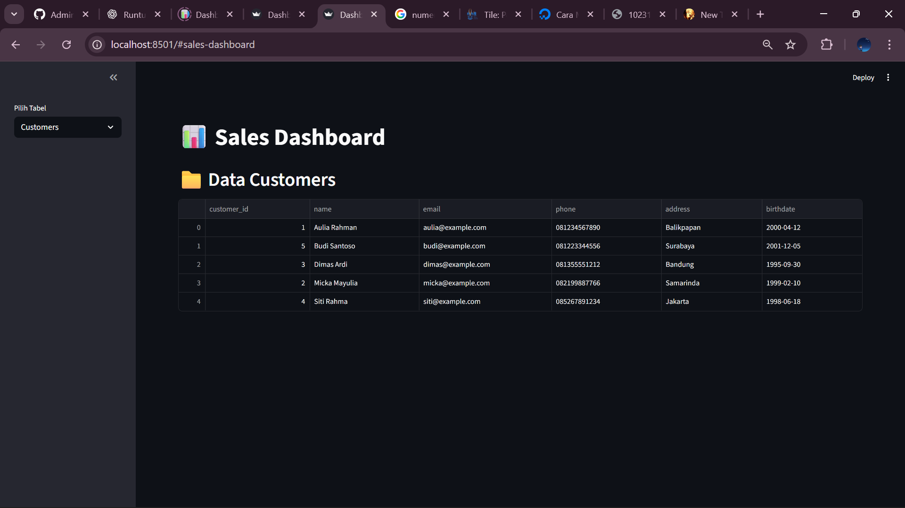
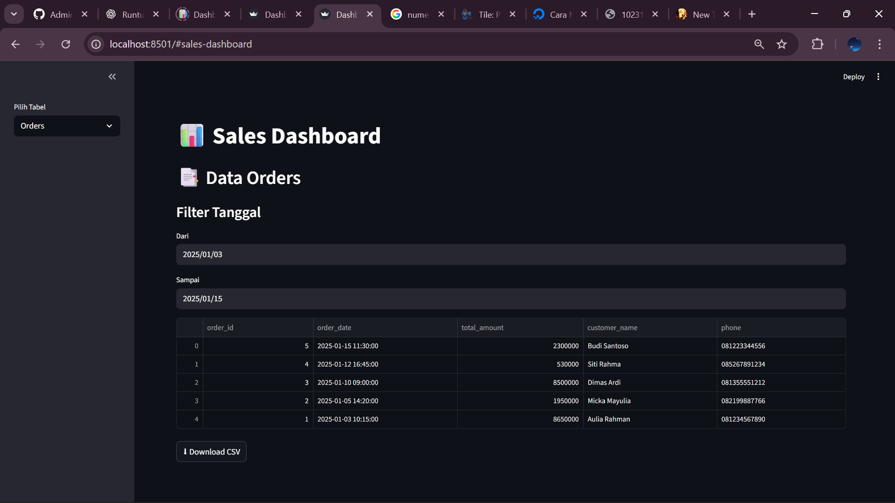
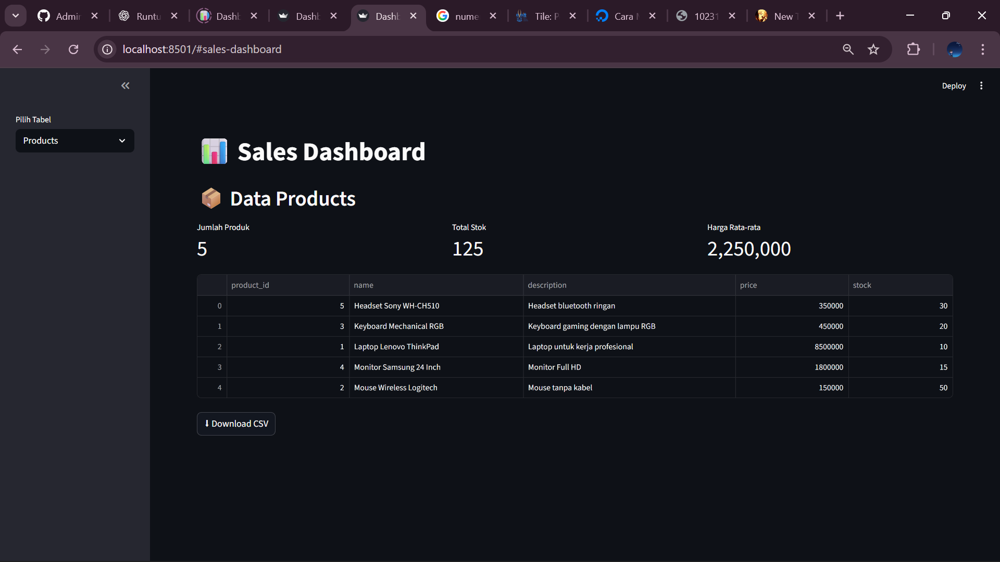
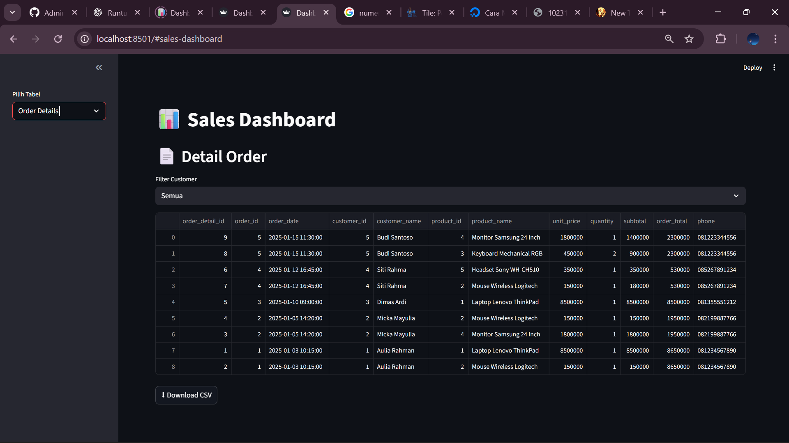
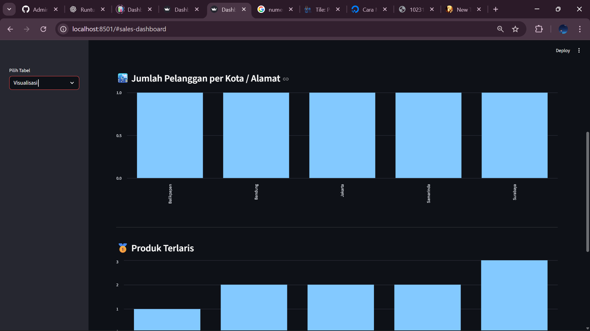
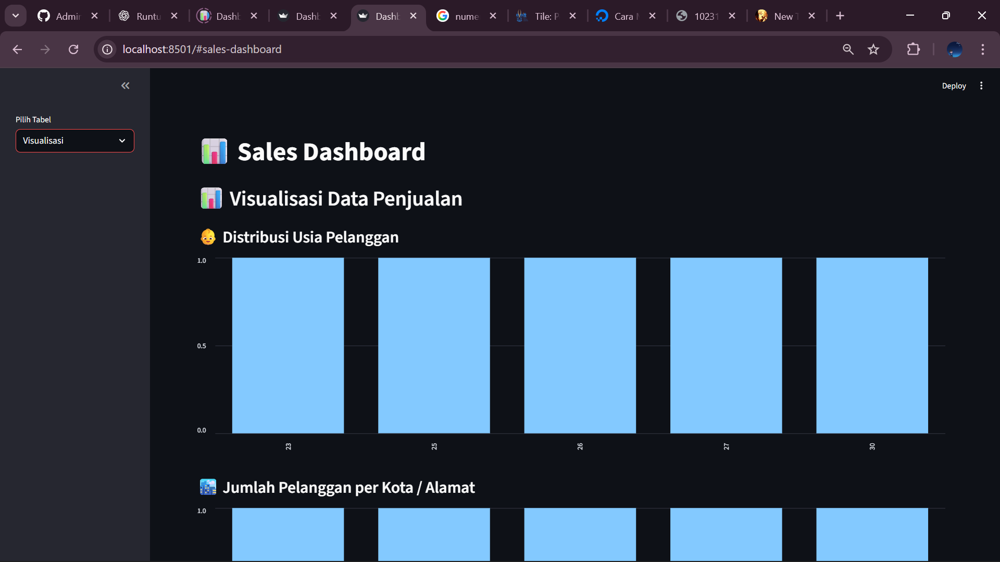
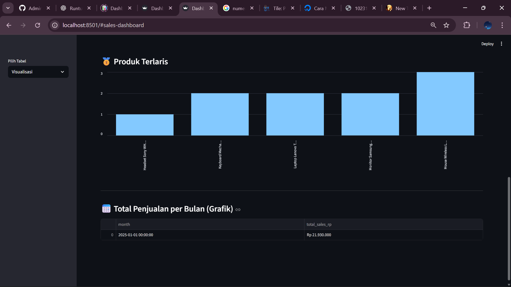
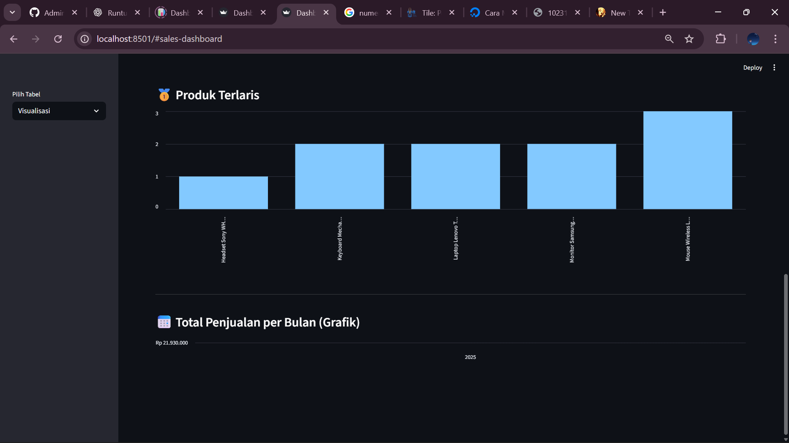

# 📊 **Laporan Implementasi Dashboard Penjualan**
### *Dengan Streamlit, PostgreSQL, Python, Miniconda*

---
## 👤 **Identitas**
- **Nama:** *Micka Mayulia Utama*
- **NIM:** *10231053*
- **Mata Kuliah:** *Adminstrasi Basis Data* 
- **Semester:** *5*
---

# 🗂️ **Jawaban**
1. [🧱 DDL – Pembuatan Tabel](#-ddl--pembuatan-tabel)
```sql
-- ======================================================
--  CREATE DATABASE
-- ======================================================
CREATE DATABASE sales_db;

-- ======================================================
--  TABLE: customers
-- ======================================================
CREATE TABLE IF NOT EXISTS customers (
    customer_id SERIAL PRIMARY KEY,
    name VARCHAR(100) NOT NULL,
    email VARCHAR(100) UNIQUE NOT NULL,
    phone VARCHAR(15),
    address TEXT,
    birthdate DATE
);

COMMENT ON COLUMN customers.birthdate IS 'Tanggal lahir pelanggan';

-- INDEX untuk pencarian cepat pelanggan berdasarkan nama
CREATE INDEX idx_customers_name ON customers (name);

-- INDEX untuk analisis/filter tanggal lahir
CREATE INDEX idx_customers_birthdate ON customers (birthdate);


-- ======================================================
--  TABLE: products
-- ======================================================
CREATE TABLE IF NOT EXISTS products (
    product_id SERIAL PRIMARY KEY,
    name VARCHAR(100) NOT NULL,
    description TEXT,
    price NUMERIC(10, 2) NOT NULL,
    stock INT NOT NULL
);

-- INDEX pencarian produk berdasarkan nama
CREATE INDEX idx_products_name ON products (name);

-- INDEX analisis harga
CREATE INDEX idx_products_price ON products (price);


-- ======================================================
--  TABLE: orders
-- ======================================================
CREATE TABLE IF NOT EXISTS orders (
    order_id SERIAL PRIMARY KEY,
    customer_id INT NOT NULL,
    order_date TIMESTAMP DEFAULT CURRENT_TIMESTAMP,
    total_amount NUMERIC(10, 2) NOT NULL,
    
    CONSTRAINT fk_customer
        FOREIGN KEY (customer_id)
        REFERENCES customers(customer_id)
        ON DELETE CASCADE
);

-- INDEX analisis tanggal pemesanan
CREATE INDEX idx_orders_order_date ON orders (order_date);

-- INDEX join cepat ke tabel customers
CREATE INDEX idx_orders_customer_id ON orders (customer_id);

-- INDEX analisis total transaksi
CREATE INDEX idx_orders_total_amount ON orders (total_amount);


-- ======================================================
--  TABLE: order_details
-- ======================================================
CREATE TABLE IF NOT EXISTS order_details (
    order_detail_id SERIAL PRIMARY KEY,
    order_id INT NOT NULL,
    product_id INT NOT NULL,
    quantity INT NOT NULL,
    price NUMERIC(10, 2) NOT NULL,

    -- subtotal dihitung otomatis di database
    subtotal NUMERIC(10, 2) GENERATED ALWAYS AS (quantity * price) STORED,

    CONSTRAINT fk_order
        FOREIGN KEY (order_id)
        REFERENCES orders(order_id)
        ON DELETE CASCADE,

    CONSTRAINT fk_product
        FOREIGN KEY (product_id)
        REFERENCES products(product_id)
        ON DELETE CASCADE
);

-- INDEX percepat JOIN Order Details ↔ Orders
CREATE INDEX idx_order_details_order_id ON order_details (order_id);

-- INDEX percepat JOIN Order Details ↔ Products
CREATE INDEX idx_order_details_product_id ON order_details (product_id);

-- INDEX analisis kuantitas barang terjual
CREATE INDEX idx_order_details_quantity ON order_details (quantity);

-- INDEX analisis harga per item
CREATE INDEX idx_order_details_price ON order_details (price);
```

2. [🧪 DML – Insert Data](#-dml--insert-data) 
```sql
/* ==========================================
   INSERT DATA: customers
   ========================================== */
INSERT INTO customers (name, email, phone, address, birthdate)
VALUES
('Aulia Rahman',      'aulia@example.com',  '081234567890', 'Balikpapan', '2000-04-12'),
('Micka Mayulia',     'micka@example.com',  '082199887766', 'Samarinda',  '1999-02-10'),
('Dimas Ardi',        'dimas@example.com',  '081355551212', 'Bandung',    '1995-09-30'),
('Siti Rahma',        'siti@example.com',   '085267891234', 'Jakarta',    '1998-06-18'),
('Budi Santoso',      'budi@example.com',   '081223344556', 'Surabaya',   '2001-12-05');


/* ==========================================
   INSERT DATA: products
   ========================================== */
INSERT INTO products (name, description, price, stock)
VALUES
('Laptop Lenovo ThinkPad',   'Laptop untuk kerja profesional',    8500000, 10),
('Mouse Wireless Logitech',  'Mouse tanpa kabel',                 150000,  50),
('Keyboard Mechanical RGB',  'Keyboard gaming RGB',               450000,  20),
('Monitor Samsung 24 Inch',  'Monitor Full HD 1080p',             1800000, 15),
('Headset Sony WH-CH510',    'Headset bluetooth ringan',          350000,  30);


/* ==========================================
   INSERT DATA: orders
   ========================================== */
INSERT INTO orders (customer_id, total_amount, order_date)
VALUES
(1, 8650000, '2025-01-03 10:15:00'),
(2, 1950000, '2025-01-05 14:20:00'),
(3, 8500000, '2025-01-10 09:00:00'),
(4, 530000,  '2025-01-12 16:45:00'),
(5, 2300000, '2025-01-15 11:30:00');


/* ==========================================
   INSERT DATA: order_details
   ========================================== */

/* Order 1 */
INSERT INTO order_details (order_id, product_id, quantity, price)
VALUES
(1, 1, 1, 8500000),
(1, 2, 1, 150000);

/* Order 2 */
INSERT INTO order_details (order_id, product_id, quantity, price)
VALUES
(2, 4, 1, 1800000),
(2, 2, 1, 150000);

/* Order 3 */
INSERT INTO order_details (order_id, product_id, quantity, price)
VALUES
(3, 1, 1, 8500000);

/* Order 4 */
INSERT INTO order_details (order_id, product_id, quantity, price)
VALUES
(4, 5, 1, 350000),
(4, 2, 1, 180000);

/* Order 5 */
INSERT INTO order_details (order_id, product_id, quantity, price)
VALUES
(5, 3, 2, 450000),
(5, 4, 1, 1400000);
```

3. [🛠️ File config.py](#️-file-configpy) 
```py
import psycopg2

# =============================
# Koneksi ke database PostgreSQL
# =============================
conn = psycopg2.connect(
    host="localhost",
    port="5432",
    user="postgres",
    password="1",
    dbname="sales_db"
)

print("Koneksi PostgreSQL berhasil!")
c = conn.cursor()

# =============================
# QUERY FUNCTIONS
# =============================

def view_customers():
    query = '''
        SELECT customer_id, name, email, phone, address, birthdate
        FROM customers
        ORDER BY name ASC
    '''
    c.execute(query)
    return c.fetchall()


def view_orders_with_customers():
    query = '''
        SELECT 
            o.order_id,
            o.order_date,
            o.total_amount,
            c.name AS customer_name,
            c.phone
        FROM orders o
        JOIN customers c ON o.customer_id = c.customer_id
        ORDER BY o.order_date DESC
    '''
    c.execute(query)
    return c.fetchall()


def view_products():
    query = '''
        SELECT product_id, name, description, price, stock
        FROM products
        ORDER BY name ASC
    '''
    c.execute(query)
    return c.fetchall()


def view_order_details_with_info():
    query = '''
        SELECT 
            od.order_detail_id,
            o.order_id,
            o.order_date,
            c.customer_id,
            c.name AS customer_name,
            p.product_id,
            p.name AS product_name,
            p.price AS unit_price,
            od.quantity,
            od.subtotal,
            o.total_amount AS order_total,
            c.phone
        FROM order_details od
        JOIN orders o ON od.order_id = o.order_id
        JOIN customers c ON o.customer_id = c.customer_id
        JOIN products p ON od.product_id = p.product_id
        ORDER BY o.order_date DESC
    '''
    c.execute(query)
    return c.fetchall()


def top_selling_products(limit=10):
    query = '''
        SELECT 
            p.name AS product_name,
            SUM(od.quantity) AS total_sold
        FROM order_details od
        JOIN products p ON od.product_id = p.product_id
        GROUP BY p.name
        ORDER BY total_sold DESC
        LIMIT %s
    '''
    c.execute(query, (limit,))
    return c.fetchall()


def sales_per_month():
    query = '''
        SELECT 
            DATE_TRUNC('month', order_date) AS month,
            SUM(total_amount) AS total_sales
        FROM orders
        GROUP BY month
        ORDER BY month
    '''
    c.execute(query)
    return c.fetchall()
```

4. [💻 File main.py](#-file-mainpy) 
```py
import streamlit as st
import pandas as pd
from datetime import datetime
from config import *

st.set_page_config(page_title="Dashboard Sales", layout="wide")

# =====================================================
# LOAD DATAFRAME AWAL
# =====================================================

df_customers = pd.DataFrame(view_customers(), columns=[
    "customer_id", "name", "email", "phone", "address", "birthdate"
])

df_products = pd.DataFrame(view_products(), columns=[
    "product_id", "name", "description", "price", "stock"
])

df_orders = pd.DataFrame(view_orders_with_customers(), columns=[
    "order_id", "order_date", "total_amount", "customer_name", "phone"
])

df_order_details = pd.DataFrame(view_order_details_with_info(), columns=[
    "order_detail_id", "order_id", "order_date",
    "customer_id", "customer_name",
    "product_id", "product_name", "unit_price",
    "quantity", "subtotal", "order_total", "phone"
])

# =====================================================
# UI
# =====================================================

st.title("📊 Sales Dashboard")

menu = st.sidebar.selectbox(
    "Pilih Tabel",
    ["Customers", "Products", "Orders", "Order Details", "Visualisasi"]
)

# =====================================================
# CUSTOMERS
# =====================================================
if menu == "Customers":
    st.header("📁 Data Customers")
    st.dataframe(df_customers, use_container_width=True)

# =====================================================
# PRODUCTS
# =====================================================
elif menu == "Products":
    st.header("📦 Data Products")

    col1, col2, col3 = st.columns(3)
    col1.metric("Jumlah Produk", df_products.shape[0])
    col2.metric("Total Stok", df_products["stock"].sum())
    col3.metric("Harga Rata-rata", f"{df_products['price'].mean():,.0f}")

    st.dataframe(df_products, use_container_width=True)

# =====================================================
# ORDERS
# =====================================================
elif menu == "Orders":
    st.header("📑 Data Orders")

    df_orders["order_date"] = pd.to_datetime(df_orders["order_date"])

    start_date = st.date_input("Dari", df_orders["order_date"].min().date())
    end_date = st.date_input("Sampai", df_orders["order_date"].max().date())

    df_filtered = df_orders[
        (df_orders["order_date"].dt.date >= start_date) &
        (df_orders["order_date"].dt.date <= end_date)
    ]

    st.dataframe(df_filtered, use_container_width=True)

# =====================================================
# ORDER DETAILS
# =====================================================
elif menu == "Order Details":
    st.header("📄 Detail Order")

    customer_list = ["Semua"] + sorted(df_order_details["customer_name"].unique())
    pilih_customer = st.selectbox("Filter Customer", customer_list)

    df_filtered = df_order_details.copy()
    if pilih_customer != "Semua":
        df_filtered = df_filtered[df_filtered["customer_name"] == pilih_customer]

    st.dataframe(df_filtered, use_container_width=True)

# =====================================================
# VISUALISASI
# =====================================================
elif menu == "Visualisasi":
    st.header("📊 Visualisasi Data Penjualan")

    # ----- 1. Usia Pelanggan -----
    df_customers["birthdate"] = pd.to_datetime(df_customers["birthdate"])
    df_customers["Age"] = (datetime.now() - df_customers["birthdate"]).dt.days // 365

    st.subheader("👶 Distribusi Usia Pelanggan")
    st.bar_chart(df_customers["Age"].value_counts().sort_index())

    st.subheader("🏙️ Pelanggan per Kota")
    st.bar_chart(df_customers["address"].value_counts())

    st.markdown("---")

    # ----- 2. Produk Terlaris -----
    st.subheader("🥇 Produk Terlaris")
    top = top_selling_products()
    if top:
        df_top = pd.DataFrame(top, columns=["product_name", "total_sold"])
        st.bar_chart(df_top.set_index("product_name"))
    else:
        st.info("Belum ada data penjualan produk.")

    st.markdown("---")

    # ----- 3. Penjualan per Bulan -----
    st.subheader("📅 Total Penjualan per Bulan")
    monthly = sales_per_month()

    if monthly:
        df_sales = pd.DataFrame(monthly, columns=["month", "total_sales"])
        df_sales["month"] = pd.to_datetime(df_sales["month"])

        st.line_chart(df_sales.set_index("month")["total_sales"])

        # Format rupiah untuk tabel
        df_sales["total_sales_rp"] = df_sales["total_sales"].apply(
            lambda x: f"Rp {x:,.0f}".replace(",", ".")
        )
        st.dataframe(df_sales[["month", "total_sales_rp"]])
    else:
        st.info("Belum ada data penjualan bulanan.")
```
5. [🧮 ERD / Relasi Tabel](#-erd--relasi-tabel) 
 

6. [📸 Output & Screenshot Dashboard](#-output--screenshot-dashboard)  
    🖼️ 1. Screenshot Data Customers
    

    🖼️ 2. Screenshot Data Orders
    

    🖼️ 3. Screenshot Data Products
    

    🖼️ 4. Screenshot Detail Order
    

    🖼️ 5. Screenshot Visualisasi Jumlah Pelanggan
    

    🖼️ 6. Screenshot Visualisasi Usia Pelanggan
    

    🖼️ 7. Screenshot Visualisasi Produk Terlaris 1
    

    🖼️ 8. Screenshot Visualisasi Produk Terlaris 2
    
